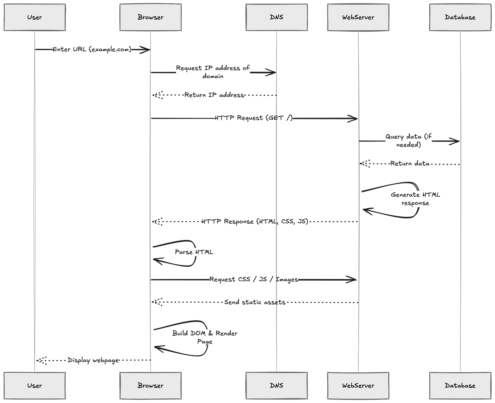
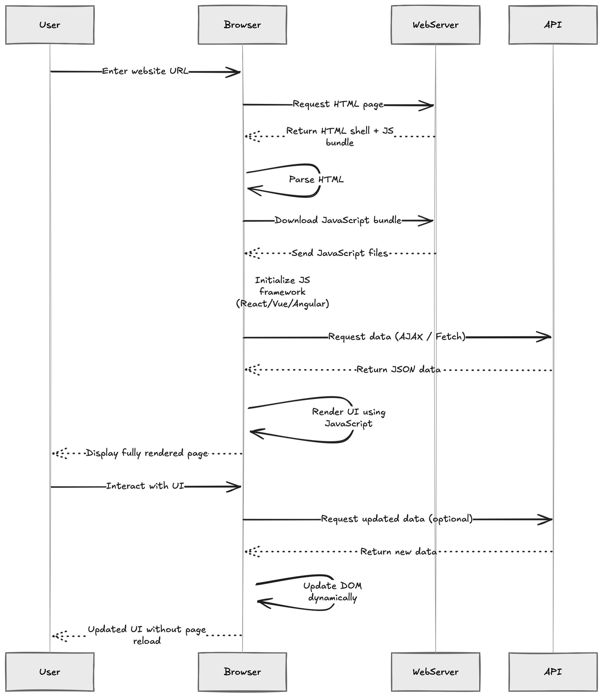
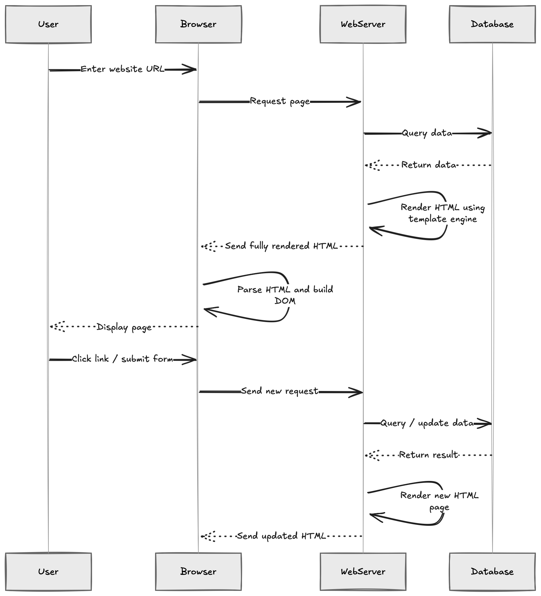

<!--
_class: lead
_paginate: skip
-->

# Node.js dengan Handlebars dan SQLite

Membangun Aplikasi Web Full-Stack dengan Template Engine dan Database

---

## Tujuan Pertemuan

- Memahami cara kerja web dan alur request-response
- Membedakan jenis-jenis web: statis, dinamis, SPA, MPA
- Memahami perbedaan CSR dan SSR
- Menguasai Node.js untuk backend development
- Menguasai Handlebars sebagai template engine SSR
- Menggunakan SQLite dengan better-sqlite3
- Membuat aplikasi web full-stack sederhana

---

## Cara Kerja Web (Gambaran Umum)

---



---

## Jenis-Jenis Web

- **Web Statis**: konten tetap, cepat, sederhana
- **Web Dinamis**: konten berubah sesuai data/user

---

## Web Statis vs Web Dinamis

- **Statis**: cocok untuk profile, landing page, dokumentasi
- **Dinamis**: cocok untuk dashboard, e-commerce, sistem akademik
- Web dinamis biasanya memerlukan backend + database
- Stack kita (Node.js + Handlebars + SQLite) adalah web dinamis

---

## CSR (Client-Side Rendering)

---



---

## SSR (Server-Side Rendering)

---



---

## Apa itu Node.js?

- Runtime JavaScript di sisi server
- Menggunakan V8 engine dari Google Chrome
- Event-driven dan non-blocking I/O
- Ekosistem package yang sangat luas (npm)

---

## Keunggulan Node.js

- JavaScript di frontend dan backend
- Performa tinggi untuk I/O operations
- Skalabilitas yang baik
- Komunitas besar dan aktif
- Package manager (npm) dengan jutaan library

---

## Apa itu Template Engine?

- Alat untuk menghasilkan HTML dinamis
- Memisahkan logic dan view
- Contoh: Handlebars, EJS, Pug

---

## Apa itu Handlebars?

- Logic-less template engine
- Syntax sederhana dan mudah dipelajari
- Memisahkan logic dan view
- Mendukung helpers dan partials
- Compatible dengan Mustache templates

---

## Keunggulan Handlebars

- Minimal logic dalam template
- Reusable components (partials)
- Custom helpers untuk logic tambahan
- Pre-compilation untuk performa
- Mendukung server-side rendering

---

## Apa itu SQLite?

- Database relational serverless
- File-based database engine
- Tidak memerlukan konfigurasi server
- Ideal untuk aplikasi kecil hingga menengah
- ACID compliant

---

## Instalasi Project

```bash
# Inisialisasi project
npm init -y

# Install dependencies
npm install express handlebars better-sqlite3

# Install dev dependencies
npm install -D nodemon
```

---

## Struktur Project

```
project/
├── views/
│   ├── layouts/
│   │   └── main.handlebars
│   ├── partials/
│   │   └── header.handlebars
│   └── home.handlebars
├── public/
│   └── css/
├── database.db
├── server.js
└── package.json
```

---

## Setup Express dengan Handlebars

```javascript
const express = require("express");
const { engine } = require("express-handlebars");

const app = express();

// Setup Handlebars
app.engine("handlebars", engine());
app.set("view engine", "handlebars");
app.set("views", "./views");

app.use(express.static("public"));
app.use(express.urlencoded({ extended: true }));
```

---

## Setup Database SQLite

```javascript
const Database = require("better-sqlite3");
const db = new Database("database.db");

// Create table
db.exec(`
  CREATE TABLE IF NOT EXISTS users (
    id INTEGER PRIMARY KEY AUTOINCREMENT,
    name TEXT NOT NULL,
    email TEXT UNIQUE NOT NULL,
    created_at DATETIME DEFAULT CURRENT_TIMESTAMP
  )
`);
```

---

## Layout Handlebars

```handlebars
<!-- views/layouts/main.handlebars -->

<html lang="id">
  <head>
    <meta charset="UTF-8" />
    <meta name="viewport" content="width=device-width, initial-scale=1.0" />
    <title>{{title}}</title>
    <link rel="stylesheet" href="/css/style.css" />
  </head>
  <body>
    {{{body}}}
  </body>
</html>
```

---

## Partial Header

```handlebars
<!-- views/partials/header.handlebars -->
<header>
  <nav>
    <h1>{{siteName}}</h1>
    <ul>
      <li><a href="/">Home</a></li>
      <li><a href="/users">Users</a></li>
      <li><a href="/about">About</a></li>
    </ul>
  </nav>
</header>
```

---

## View dengan Data

```handlebars
<!-- views/home.handlebars -->
{{> header siteName="My App"}}

<main>
  <h2>Welcome to {{title}}</h2>

  {{#if users}}
    <ul>
      {{#each users}}
        <li>{{this.name}} - {{this.email}}</li>
      {{/each}}
    </ul>
  {{else}}
    <p>No users found.</p>
  {{/if}}
</main>
```

---

## Handlebars Helpers

```javascript
const { engine } = require("express-handlebars");

app.engine(
  "handlebars",
  engine({
    helpers: {
      formatDate: (date) => {
        return new Date(date).toLocaleDateString("id-ID");
      },
      uppercase: (str) => {
        return str.toUpperCase();
      },
    },
  }),
);
```

---

## Menggunakan Helpers

```handlebars
<div>
  <h3>{{uppercase name}}</h3>
  <p>Registered: {{formatDate created_at}}</p>
</div>
```

---

## Query Data dengan better-sqlite3

```javascript
// Get all users
const getAllUsers = () => {
  const stmt = db.prepare("SELECT * FROM users");
  return stmt.all();
};

// Get single user
const getUserById = (id) => {
  const stmt = db.prepare("SELECT * FROM users WHERE id = ?");
  return stmt.get(id);
};
```

---

## Insert Data

```javascript
// Insert new user
const createUser = (name, email) => {
  const stmt = db.prepare("INSERT INTO users (name, email) VALUES (?, ?)");
  const info = stmt.run(name, email);
  return info.lastInsertRowid;
};
```

---

## Update dan Delete

```javascript
// Update user
const updateUser = (id, name, email) => {
  const stmt = db.prepare("UPDATE users SET name = ?, email = ? WHERE id = ?");
  return stmt.run(name, email, id);
};

// Delete user
const deleteUser = (id) => {
  const stmt = db.prepare("DELETE FROM users WHERE id = ?");
  return stmt.run(id);
};
```

---

## Route: Homepage

```javascript
app.get("/", (req, res) => {
  const users = getAllUsers();
  res.render("home", {
    title: "Homepage",
    users: users,
  });
});
```

---

## Route: Create User

```javascript
app.post("/users", (req, res) => {
  const { name, email } = req.body;

  try {
    createUser(name, email);
    res.redirect("/");
  } catch (error) {
    res.render("error", {
      message: "Email already exists",
    });
  }
});
```

---

## Route: User Detail

```javascript
app.get("/users/:id", (req, res) => {
  const user = getUserById(req.params.id);

  if (user) {
    res.render("user-detail", { user });
  } else {
    res.status(404).render("404");
  }
});
```

---

## Transaksi Database

```javascript
// Transaksi untuk multiple operations
const transferData = (fromId, toId, amount) => {
  const transaction = db.transaction(() => {
    db.prepare("UPDATE accounts SET balance = balance - ? WHERE id = ?").run(
      amount,
      fromId,
    );
    db.prepare("UPDATE accounts SET balance = balance + ? WHERE id = ?").run(
      amount,
      toId,
    );
  });

  transaction();
};
```

---

## Prepared Statements untuk Keamanan

```javascript
// GOOD: Prepared statement (aman dari SQL injection)
const stmt = db.prepare("SELECT * FROM users WHERE email = ?");
const user = stmt.get(email);

// BAD: String concatenation (berbahaya!)
// const user = db.prepare(
//   `SELECT * FROM users WHERE email = '${email}'`
// ).get();
```

---

## Form Input dengan Handlebars

```handlebars
<form action="/users" method="POST">
  <div>
    <label for="name">Name:</label>
    <input type="text" id="name" name="name" required />
  </div>

  <div>
    <label for="email">Email:</label>
    <input type="email" id="email" name="email" required />
  </div>

  <button type="submit">Create User</button>
</form>
```

---

## Pagination dengan SQLite

```javascript
app.get("/users", (req, res) => {
  const page = parseInt(req.query.page) || 1;
  const limit = 10;
  const offset = (page - 1) * limit;

  const users = db
    .prepare("SELECT * FROM users LIMIT ? OFFSET ?")
    .all(limit, offset);

  const total = db.prepare("SELECT COUNT(*) as count FROM users").get().count;

  res.render("users", { users, page, totalPages: Math.ceil(total / limit) });
});
```

---

## Search Functionality

```javascript
app.get("/search", (req, res) => {
  const query = req.query.q;

  const users = db
    .prepare(
      `
    SELECT * FROM users 
    WHERE name LIKE ? OR email LIKE ?
  `,
    )
    .all(`%${query}%`, `%${query}%`);

  res.render("search-results", { users, query });
});
```

---

## Conditional Rendering

```handlebars
{{#if user.isAdmin}}
  <button class="delete">Delete User</button>
{{else}}
  <p>You don't have permission</p>
{{/if}}

{{#unless user.verified}}
  <div class="alert">Please verify your email</div>
{{/unless}}
```

---

## Loops dan Iterasi

```handlebars
{{#each users}}
  <div class="user-card">
    <h3>{{this.name}}</h3>
    <p>{{this.email}}</p>
    <small>User #{{@index}} of {{@root.users.length}}</small>
  </div>
{{else}}
  <p>No users to display</p>
{{/each}}
```

---

## Menjalankan Server

```javascript
const PORT = process.env.PORT || 3000;

app.listen(PORT, () => {
  console.log(`Server running on http://localhost:${PORT}`);
});

// Graceful shutdown
process.on("exit", () => db.close());
process.on("SIGINT", () => {
  db.close();
  process.exit(0);
});
```

---

## Package.json Scripts

```json
{
  "scripts": {
    "start": "node server.js",
    "dev": "nodemon server.js",
    "seed": "node seed.js"
  }
}
```

---

## Tips Debugging

- Gunakan `console.log()` untuk melihat data
- Cek struktur database dengan DB Browser for SQLite
- Gunakan browser DevTools untuk inspect HTML
- Set `NODE_ENV=development` untuk error messages
- Gunakan nodemon untuk auto-restart

---

## Ringkasan

- Node.js memungkinkan JavaScript di server
- Handlebars memisahkan logic dan view
- better-sqlite3 memberikan database yang cepat dan mudah
- Kombinasi ketiganya ideal untuk aplikasi full-stack
- Prepared statements penting untuk keamanan
